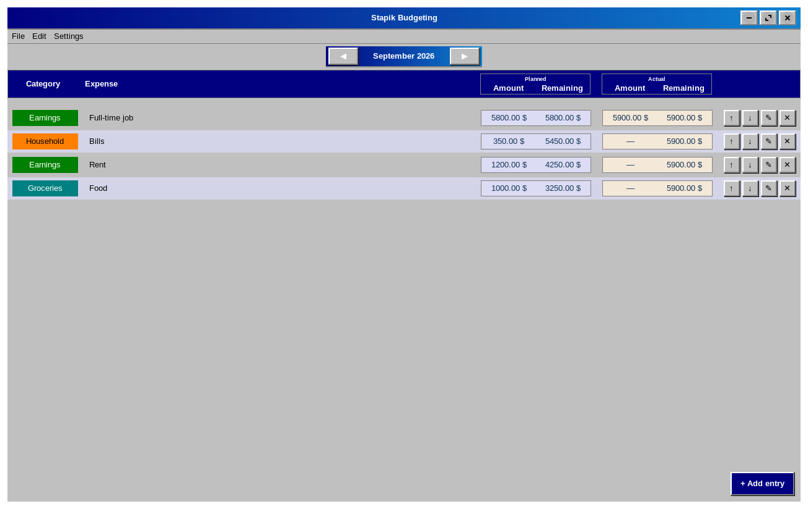
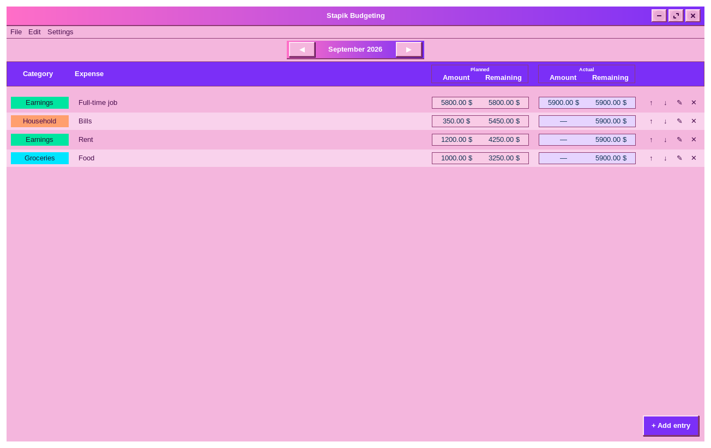
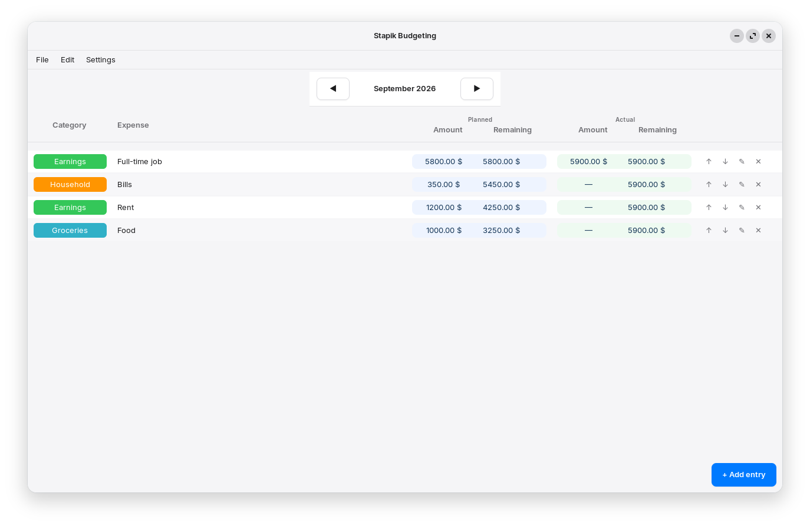

# Stapik Budgeting

A desktop budgeting application for Linux, written in C++20 using GTK4/gtkmm. Track your income and expenses in a simple monthly view, with customizable categories, currencies, languages and themes.



## Features

* **Monthly view** — organize your budget by month and keep your financial entries in one place.
* **Income and expenses** — track planned and actual amounts and see the remaining totals for the current month.
* **Custom categories** — own categories, each with a customizable color.
* **Multiple currencies** — choose from a catalog of currencies, with localized currency names and persistent selection.
* **Cloud sync** — save and load your budget via an external API, compatible with a self-hosted server, with automatic conflict resolution based on timestamps.
* **Multilingual UI** — Polish, English and German interface with instant switching.
* **Auto-save** — budget data is saved locally after every change.
* **Three themes** — Classic, Modern and Classic Pink, switchable live from the menu.
* **Retro aesthetic** — the Classic theme features the original old-school look with raised controls, blue accents and grey cells.

## Dependencies

* `gtkmm-4.0`
* `libcurl`
* [`stapik-common`](https://github.com/stapik/stapik-common) (fetched automatically via CMake FetchContent)
* `nlohmann/json` (fetched automatically via CMake FetchContent, transitively provided by `stapik-common`)

On Ubuntu/Debian:

```bash
sudo apt install libgtkmm-4.0-dev libcurl4-openssl-dev
```

Building a `.deb` package additionally requires `dpkg-dev` (used to auto-detect runtime dependencies):

```bash
sudo apt install dpkg-dev
```

## Building

```bash
git clone https://github.com/Stapik-Group/stapik-budgeting
cd stapik-budgeting
cmake -B cmake-build-release -DCMAKE_BUILD_TYPE=Release
cmake --build cmake-build-release
```

## Installation

### Option 1 — Download prebuilt `.deb` (recommended)

Download the latest `.deb` package from the [Releases page](https://github.com/Stapik-Group/stapik-budgeting/releases), then install it:

```bash
sudo dpkg -i stapikbudgeting_*.deb
sudo apt install -f   # resolves any missing runtime dependencies
```

### Option 2 — Build `.deb` from source

If you'd rather build the package yourself:

```bash
cd cmake-build-release
cpack -G DEB
sudo dpkg -i stapikbudgeting_*.deb
sudo apt install -f
```

Either option installs the app to `/usr/lib/stapikbudgeting/`, with a launcher at `/usr/bin/stapikbudgeting`, and it appears in the desktop environment's application menu.

### Option 3 — Per-user install (no sudo required)

```bash
cmake --install cmake-build-release --prefix "$HOME/.local"
```

Installs to `~/.local/lib/stapikbudgeting/`, with a launcher at `~/.local/bin/stapikbudgeting`. Make sure `~/.local/bin` is in your `PATH`.

## Uninstalling

### If installed via `.deb`

```bash
sudo dpkg -r stapikbudgeting
```

### If installed per-user

```bash
rm -rf ~/.local/lib/stapikbudgeting
rm ~/.local/bin/stapikbudgeting
rm ~/.local/share/applications/stapikbudgeting.desktop
rm ~/.local/share/icons/hicolor/256x256/apps/stapikbudgeting.png
```

Uninstalling the application does not remove your budget data, cloud configuration, language preference, theme or currency preference stored in `~/.local/share/stapikbudgeting/`.

## Cloud Sync

The app supports synchronization via [Stapik Cloud](https://github.com/Stapik-Group/stapik-cloud). Go to **File → Connect**, enter the server URL and API key. If a connection is already configured, the app reconnects automatically on startup.

Once connected, the app compares the local budget and the cloud copy using a `lastUpdate` timestamp and keeps whichever one is newer, overwriting the other **as a whole document**. There is no field-level or entry-level merging — if both copies changed since the last sync, the older document is fully replaced.

Budget data is saved locally after every change, and the app also attempts to push it to the cloud immediately. Changes to the selected currency are treated as budget changes and are synchronized as well.

Writes use optimistic concurrency checking: if another device saved a newer version in the meantime, the write is rejected, the server's copy is fetched, and the app retries once against that version before falling back to accepting the server's version. If the cloud is unreachable, the change remains saved locally and will be retried on the next save. You can also trigger synchronization manually from **File → Sync**.

**Caution for multi-device use:** because conflict resolution operates on the whole document, editing the budget offline on two different machines before either one reconnects can cause one set of changes to be discarded. Stapik Cloud keeps a version history of every write, so a discarded document is not permanently lost, but the application does not currently expose a way to browse or restore previous versions. If you use the app on multiple devices, synchronize regularly to avoid overwriting your own changes.

The app communicates with the Stapik Cloud `/documents/{slotKey}` endpoint using an `x-api-key` header.

If you're upgrading from an app version that used an older, incompatible cloud protocol, the app detects this automatically on first launch and clears the saved connection. You will need to reconnect once via **File → Connect**.

## Data Storage

Budget data is stored locally at:

```text
~/.local/share/stapikbudgeting/budget.json
```

The document contains the budget categories, periods, currency code and `lastUpdate` timestamp used for cloud synchronization.

Other application data is stored at:

```text
~/.local/share/stapikbudgeting/config.json
~/.local/share/stapikbudgeting/locale.txt
~/.local/share/stapikbudgeting/theme.txt
~/.local/share/stapikbudgeting/currency.txt
```

Cloud configuration, language, theme and currency preferences are kept separately from the synchronized budget document.

## Themes

Switch between three themes from **Settings → Theme**:

* **Classic** — the original retro look with raised controls, blue accents and grey cells.
* **Modern** — a clean, flat and minimal appearance.
* **Classic Pink** — the retro aesthetic with a pink color palette.

The theme applies instantly and is remembered between launches.




## TODO

* [x] Monthly budget view
* [x] Income and expense tracking
* [x] Custom categories with colors
* [x] Multiple currencies
* [x] Multilingual UI
* [x] Cloud sync with conflict resolution
* [x] Auto-save
* [x] `.deb` package for easier distribution
* [x] Multiple themes (Classic / Modern / Classic Pink)
* [ ] Import from an existing spreadsheet (CSV/XLSX)
* [ ] Budget statistics and charts
* [ ] Flatpak package
